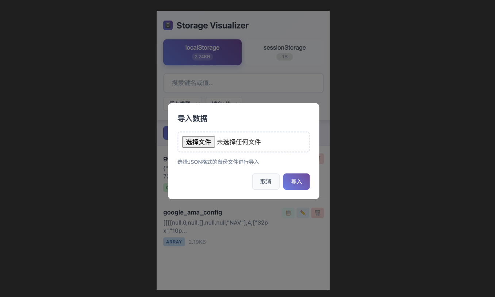
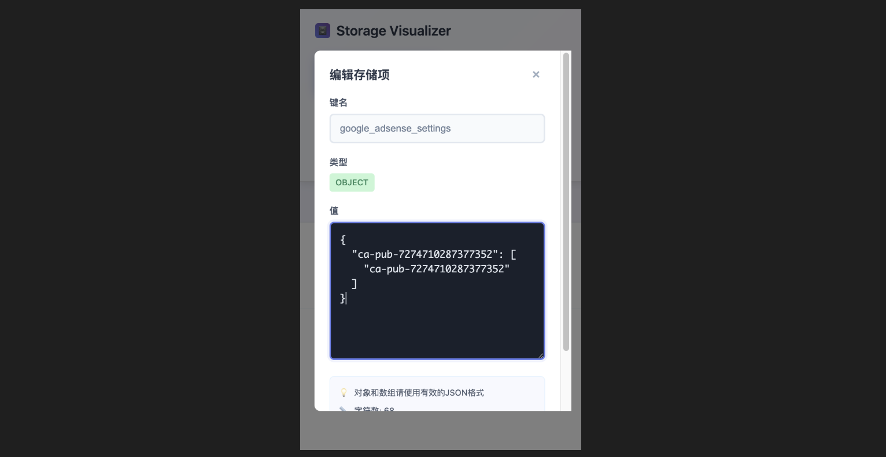

# Storage Visualizer - 强大的浏览器存储可视化工具

## 🚀 插件简介

Storage Visualizer 是一款专为开发者设计的 Chrome 浏览器扩展，旨在提供直观、高效的 localStorage 和 sessionStorage 数据管理体验。无论您是前端开发者、测试工程师还是数据分析师，这款工具都能帮您轻松查看、编辑和管理浏览器存储数据。

## ✨ 核心功能特性

### 📊 双存储模式可视化
- **localStorage 管理**：查看和编辑持久化存储数据
- **sessionStorage 管理**：管理会话级别的临时数据
- **实时存储大小显示**：直观展示每种存储类型的占用空间
- **一键切换**：在两种存储模式间快速切换

### 🔍 智能搜索与过滤
- **全文搜索**：支持键名和值的模糊搜索
- **精确搜索**：可选择仅搜索键名或仅搜索值
- **类型过滤**：按数据类型（字符串、对象、数组、数字、布尔值）筛选
- **实时过滤**：输入即时显示搜索结果

### 🎨 现代化用户界面
- **渐变设计**：采用现代渐变色彩方案
- **类型标识**：不同数据类型用颜色区分显示
- **响应式布局**：适配不同屏幕尺寸
- **悬停效果**：丰富的交互反馈

### ✏️ 强大的编辑功能
- **智能编辑器**：根据数据类型提供相应的编辑体验
- **JSON 格式化**：自动格式化对象和数组类型数据
- **实时验证**：编辑时即时验证 JSON 格式
- **字符计数**：实时显示值的字符数量
- **键盘快捷键**：支持 ESC 键快速关闭编辑器

### 📤 数据导入导出
- **一键导出**：将当前存储数据导出为 JSON 文件
- **批量导入**：从 JSON 文件批量导入数据
- **格式验证**：导入时自动验证数据格式
- **操作反馈**：详细的成功/失败提示信息

### 🗑️ 数据管理操作
- **单项删除**：快速删除指定的存储项
- **批量清空**：一键清空所有存储数据
- **复制功能**：快速复制存储值到剪贴板
- **确认机制**：重要操作前的安全确认

## 🛠️ 技术特色

### 现代化架构
- **模块化设计**：代码分离为数据层、工具层和界面层
- **异步处理**：使用 async/await 处理数据操作
- **Chrome Extensions API**：充分利用浏览器扩展能力

### 用户体验优化
- **Toast 提示**：优雅的操作反馈机制
- **模态框交互**：流畅的弹窗操作体验
- **加载状态**：清晰的数据加载和错误状态显示
- **无障碍设计**：考虑键盘导航和屏幕阅读器支持

### 数据安全
- **本地处理**：所有数据处理在本地进行，保护隐私
- **格式验证**：严格的数据格式检查
- **错误处理**：完善的异常捕获和用户提示

## 🎯 适用场景

### 开发调试
- 查看应用存储的用户数据
- 测试不同存储状态下的应用行为
- 调试存储相关的 bug

### 数据分析
- 分析网站存储的数据结构
- 监控存储空间使用情况
- 导出数据进行进一步分析

### 测试验证
- 验证数据持久化功能
- 测试存储容量限制
- 模拟不同的数据状态

## 🚀 使用体验

Storage Visualizer 提供了直观的操作界面，用户只需点击浏览器工具栏中的插件图标即可打开。界面采用卡片式设计，每个存储项都清晰地显示键名、值预览、数据类型和大小信息。通过颜色编码的类型标签，用户可以快速识别不同类型的数据。

编辑功能特别贴心，对于 JSON 格式的数据会自动进行格式化显示，并提供实时的语法验证。搜索功能支持多种模式，无论是查找特定的键名还是搜索值内容，都能快速定位目标数据。

